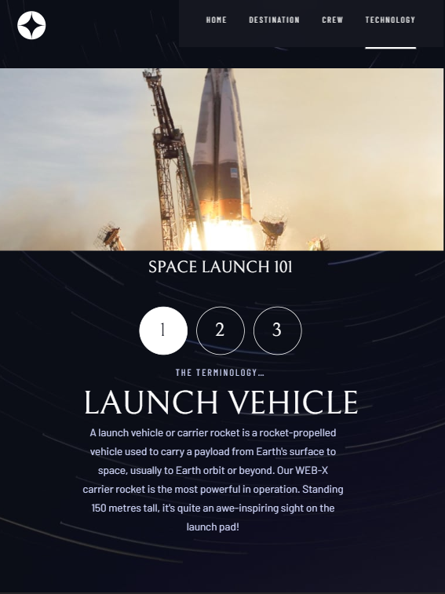

# Frontend Mentor - Space tourism website solution

## Table of contents

- [Overview](#overview)
  - [The challenge](#the-challenge)
  - [Screenshot](#screenshot)
  - [Links](#links)
- [My process](#my-process)
  - [Built with](#built-with)
  - [What I learned](#what-i-learned)
- [Author](#author)

## Overview

### The challenge

Users should be able to:

- View the optimal layout for each of the website's pages depending on their device's screen size
- See hover states for all interactive elements on the page
- View each page and be able to toggle between the tabs to see new information

### Screenshot

### Links

- Solution URL: [Solution URL here](https://www.frontendmentor.io/solutions/space-tourism-multipage-website-jdX0LBybqe)
- Live Site URL: [ Live site URL here](https://64fa25238077c7444028fe3a--fancy-florentine-32647d.netlify.app/)

## My process

### Built with

- Semantic HTML5 markup
- CSS custom properties
- Flexbox
- CSS Grid
- Mobile-first workflow
- [React](https://reactjs.org/) - JS library

### What I learned

When i worked on this project, i learned a lot of stuff. First, I understood the importance of avoiding code duplication and using common classes.You used the react dom while coding the project.Making mobile and tablet versions also made it difficult for me in terms of design, I know the project has a few shortcomings, but it was an instructive challenge that I really enjoyed doing.Additionally I used an effective sass pattern structure, and it was very useful for me to use it..See you in the next challenges.

## Author

- Website - [Guney Unay](https://www.guneyunay.com)
- Frontend Mentor - [@unaygney](https://www.frontendmentor.io/profile/unaygney)

